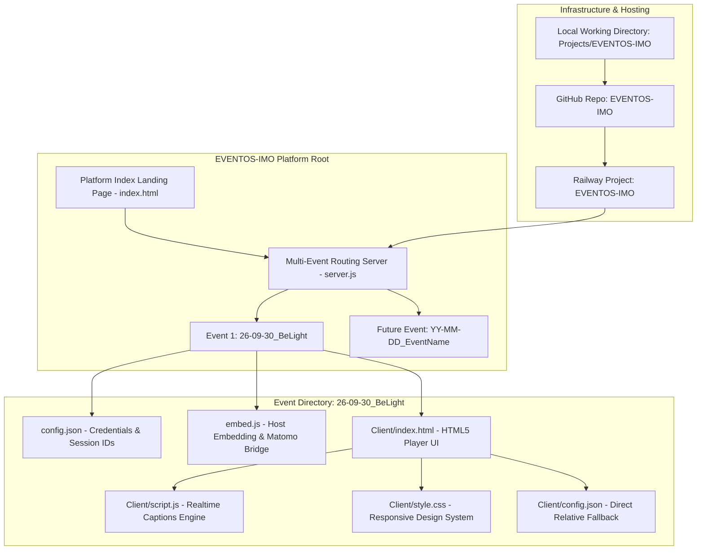

# Technical Implementation Plan: EVENTOS-IMO Platform

> [!IMPORTANT]
> **Instructions for the Coding Agent**:
> 1. **Incremental bottom-up execution**: Follow this roadmap in order, starting from Phase 0 (UI Skeleton & Platform Shell). Do not jump ahead.
> 2. **Explicit Verification & Approval Gates**: After completing each phase, execute its specified verification step. Stop and present results to the user for explicit approval before advancing to the next phase.
> 3. **Dynamic Task Discovery & Sync**: If you or the user encounter logical inconsistencies, missing edge cases, or implementation details that require new tasks or sub-tasks, immediately:
>    - Add the new task/sub-task under the appropriate phase in this file (`02-Implementation.md`).
>    - Document and update the corresponding files in [01-idea.md](./01-idea.md) and [00-index.md](./00-index.md).
> 4. **No Code in Tasks**: Keep this file purely procedural. Do not add raw code blocks or implementation code directly to this file. Refer to [01-idea.md](./01-idea.md) and [00-index.md](./00-index.md) using relative paths.
> 5. **Doubt Resolution**: In case of ambiguity or multiple viable implementation paths, stop and ask the user, presenting trade-offs clearly.

---

## 1. Architectural Overview & Dependency Flow

The **EVENTOS-IMO** platform operates as a centralized event hub and multi-tenant static/dynamic hosting server on Railway. It hosts an index landing page linking to individual live broadcast events, with each event isolated in its own sub-folder containing its dedicated configuration, embeddable script, and HTML5 player client.



---

## 2. Directory Layout & File Responsibility Matrix

The repository and Railway deployment follow this exact structure:

```text
EVENTOS-IMO/
├── 00-index.md                    # Project documentation & file catalog [refer to ./00-index.md]
├── 01-idea.md                     # Platform vision, event spec, & hosting requirements [refer to ./01-idea.md]
├── 02-Implementation.md           # Implementation plan & phase checklist (this file)
├── package.json                   # Node.js process definition, scripts, and runtime engines
├── server.js                      # Central HTTP routing server, MIME handler, & subpath aliasing
├── index.html                     # Platform root landing page linking to all events
├── style.css                      # Platform landing page styles (modern glassmorphism, responsive)
└── 26-09-30_BeLight/              # Event subfolder for Be-Light (2026-09-30)
    ├── 00-index.md                # Event-level documentation [refer to ./26-09-30_BeLight/00-index.md]
    ├── config.json                # Supabase credentials & YouTube broadcast IDs [refer to ./26-09-30_BeLight/config.json]
    ├── embed.js                   # Host page embed helper & Matomo telemetry bridge [refer to ./26-09-30_BeLight/embed.js]
    └── Client/
        ├── index.html             # Video player, controls bar, and subtitle box [refer to ./26-09-30_BeLight/Client/index.html]
        ├── script.js              # YouTube API, Supabase Realtime, TTS reader [refer to ./26-09-30_BeLight/Client/script.js]
        ├── style.css              # Subtitle, controls, and dark/light styling [refer to ./26-09-30_BeLight/Client/style.css]
        └── config.json            # Local relative config mirror [refer to ./26-09-30_BeLight/Client/config.json]
```

---

## Phase 0: UI Skeleton & Platform Shell Navigation
*Focus: Establish the platform landing page shell, visual branding, and navigation paths to event subfolders.*

- [x] **Task 0.1: Platform Root Landing Page UI Shell**
  - **Objective**: Build the top-level index landing page for EVENTOS-IMO displaying available events.
  - **Details**:
    - [x] Create semantic HTML layout with header branding, platform subtitle, and event grid container [refer to ./01-idea.md].
    - [x] Implement event card component for the active event `26-09-30_BeLight` with event date, title, session pills, and direct player link.
    - [x] Add empty/placeholder slot indicating upcoming future events to demonstrate extensibility.
    - [x] Establish minimalist, clinical CSS design system inspired by "www.miranza.es" (deep navy `#002D62`, clinical blue `#00669D`, Miranza green `#73cf91`, soft background `#F7F9FA`, fluid typography, and clean card hover states).
  - **Verification**:
    - Open the landing page in a browser. Confirm that the platform header, Be-Light event card, session action links, and upcoming event placeholder render cleanly on desktop and mobile viewports with the Miranza aesthetic.

- [x] **Task 0.2: Navigation Flow & Parameter Hand-off**
  - **Objective**: Verify seamless navigation from the platform landing page to event sessions.
  - **Details**:
    - [x] Configure action links on the Be-Light card targeting `session_1` and `session_2` query parameters [refer to ./26-09-30_BeLight/config.json].
    - [x] Configure direct navigation to the full player view (`/26-09-30_BeLight/Client/index.html?session=session_1`).
    - [x] Provide a return link/breadcrumb inside the event view to navigate back to the platform root.
  - **Verification**:
    - Click `session_1` from the landing page. Verify navigation lands on the player with `?session=session_1` preserved in the URL.
    - Click `session_2` from the landing page. Verify navigation lands on the player with `?session=session_2` preserved.

> [!NOTE]
> **Phase 0 Approval Gate**: Completed and verified.

---

## Phase 1: Multi-Event HTTP Server & Routing Engine
*Focus: Build a robust, zero-dependency Node.js server that routes platform traffic, handles subpath aliases, and serves static assets with CORS support.*

- [x] **Task 1.1: Platform HTTP Server Architecture**
  - **Objective**: Create the core Node.js web server with environment-driven port binding and MIME resolution.
  - **Details**:
    - [x] Create project manifest with start script and Node engine specifications [refer to ./01-idea.md].
    - [x] Implement HTTP server binding to environment port or defaulting to port 3000.
    - [x] Implement complete MIME type map for HTML, JS, CSS, JSON, SVG, PNG, JPG, and ICO.
    - [x] Add permissive CORS response headers (`Access-Control-Allow-Origin: *`) to ensure `embed.js` and `config.json` can be loaded from external client host domains.
    - [x] Add security path normalization to prevent directory traversal outside the project root.
  - **Verification**:
    - Start the server locally. Send HTTP GET requests to root `/` and verify HTTP 200 OK with correct `text/html` Content-Type and CORS headers.

- [x] **Task 1.2: Subpath Aliasing & Internal Rewrite Routing**
  - **Objective**: Support clean URLs and internal rewrites for event subdirectories without browser address bar redirects.
  - **Details**:
    - [x] Implement internal rewrite: when a request targets an event folder (e.g. `/26-09-30_BeLight/` or `/26-09-30_BeLight`), internally serve `/26-09-30_BeLight/Client/index.html` without HTTP 301/302 redirects, keeping the clean event URL in the browser [refer to ./01-idea.md].
    - [x] Preserve all URL query parameters (such as `session=session_1` or `theme=light`) during the internal rewrite.
    - [x] Implement intelligent asset resolution: if an internal rewrite event page requests relative assets like `script.js` or `style.css` (which live in `Client/`), automatically resolve them from `${eventDir}/Client/${file}` or `${eventDir}/${file}` seamlessly.
    - [x] Support direct asset requests for embed scripts and configurations (e.g. `/26-09-30_BeLight/embed.js`, `/26-09-30_BeLight/config.json`).
    - [x] Implement graceful fallback: unknown routes return HTTP 404 with a clean error message, and directory requests without index files fallback to root.
  - **Verification**:
    - Request `/26-09-30_BeLight/` in the browser. Verify the event player loads directly, the address bar remains `/26-09-30_BeLight/`, and all sub-assets (`style.css`, `script.js`, `config.json`) load with HTTP 200 OK.
    - Request `/26-09-30_BeLight/embed.js`. Verify the script file is returned with `text/javascript`.
    - Request `/26-09-30_BeLight/config.json`. Verify JSON configuration is returned with `application/json`.

- [x] **Task 1.3: Server Logging & Diagnostic Output**
  - **Objective**: Provide structured request logging for operational debugging in Railway logs.
  - **Details**:
    - [x] Log incoming request method, path, client IP, and response status code.
    - [x] Add startup banner logging active port and registered event directories.
  - **Verification**:
    - Observe terminal output while navigating between pages. Verify structured logs reflect each request accurately.

> [!NOTE]
> **Phase 1 Approval Gate**: Completed and verified.

---

## Phase 2: Be-Light Event Integration & Verification
*Focus: Verify that the Be-Light event client loads credentials properly, synchronizes subtitles in real-time, and operates cleanly via direct access and embedding.*

- [x] **Task 2.1: Configuration Resolution & Multi-Session Mappings**
  - **Objective**: Verify that the client resolves Supabase credentials and YouTube IDs for both sessions.
  - **Details**:
    - [x] Validate `config.json` contents against project requirements [refer to ./26-09-30_BeLight/config.json].
    - [x] Verify multi-path candidate loader finds `config.json` via relative resolution paths [refer to ./26-09-30_BeLight/Client/script.js].
    - [x] Verify `session_1` resolves to YouTube ID `JVe72x6qjfo`.
    - [x] Verify `session_2` resolves to YouTube ID `XZ6oYuFedCk`.
    - [x] Verify Supabase endpoint `https://kcdhrxtbylpaceeoglpq.supabase.co` and anonymous key are initialized.
  - **Verification**:
    - Launch the client with `?session=session_1`. Open browser developer console and confirm log output confirms `Active Session: session_1 -> YouTube ID: JVe72x6qjfo` and Supabase initialization success.
    - Repeat with `?session=session_2`. Confirm YouTube ID resolves to `XZ6oYuFedCk`.

- [x] **Task 2.2: YouTube Player & Subtitle Realtime Streaming**
  - **Objective**: Confirm video playback, custom HTML5 controls, and Supabase live captions.
  - **Details**:
    - [x] Test video loading, poster fallback, and central unmute overlay functionality [refer to ./26-09-30_BeLight/Client/index.html].
    - [x] Verify custom controls bar: Play/Pause, Mute/Volume slider, Fullscreen, and LIVE status badge.
    - [x] Verify Supabase Realtime channel subscription to the `captions` table.
    - [x] Verify 2-line subtitle display box formatting, language toggle (Spanish/English), and TTS speech synthesis toggle.
  - **Verification**:
    - Play the video. Confirm video playback starts, audio unmute overlay functions on click, and subtitles render with high contrast.

- [x] **Task 2.3: Embed Helper Script & Host Telemetry Bridge**
  - **Objective**: Validate third-party embedding via `embed.js` and Matomo analytics bridging.
  - **Details**:
    - [x] Verify `.livespeech-embed` container discovery and responsive iframe creation [refer to ./26-09-30_BeLight/embed.js].
    - [x] Verify postMessage telemetry forwarding from the player iframe to host `window._paq` and `Matomo.MediaAnalytics`.
    - [x] Validate MutationObserver behavior for dynamically injected embed containers.
  - **Verification**:
    - Create a test host page with a `.livespeech-embed` container referencing the server's `embed.js`.
    - Confirm the iframe is created with correct session parameters and analytics events are emitted via postMessage.

> [!NOTE]
> **Phase 2 Approval Gate**: Completed and verified.

---

## Phase 3: GitHub Repository & Railway Cloud Deployment
*Focus: Set up the GitHub repository, connect Railway for automated deployment, and verify production endpoints.*

- [x] **Task 3.1: Git Repository Structure & Local Version Control**
  - **Objective**: Initialize and configure the Git repository for EVENTOS-IMO.
  - **Details**:
    - [x] Create `.gitignore` to exclude OS files (`.DS_Store`), temporary artifacts, and node modules while ensuring all project code and documentation are tracked.
    - [x] Initialize Git repository in the project folder [refer to ./01-idea.md].
    - [x] Verify file status and create clean initial commit.
    - [ ] Link local repository to remote GitHub repository named `EVENTOS-IMO`.
  - **Verification**:
    - Run `git status`. Verify working tree is clean and only desired files are staged.
    - Verify remote origin URL points to `https://github.com/<user>/EVENTOS-IMO.git`.

- [ ] **Task 3.2: Railway Project Setup & Continuous Deployment**
  - **Objective**: Provision a new Railway project and connect it to the GitHub repository.
  - **Details**:
    - [ ] Create a new project in Railway named `EVENTOS-IMO` [refer to ./01-idea.md].
    - [ ] Connect the Railway service to the `EVENTOS-IMO` GitHub repository.
    - [ ] Configure deployment settings: start command (`npm start`), automatic build trigger on push to `main` branch.
    - [ ] Configure public networking domain on Railway.
  - **Verification**:
    - Trigger initial deployment. Observe Railway deployment build logs. Confirm zero errors and successful service start on allocated port.

- [ ] **Task 3.3: Production Environment Verification & Health Check**
  - **Objective**: Perform end-to-end verification of the deployed Railway platform.
  - **Details**:
    - [ ] Navigate to the public Railway production URL.
    - [ ] Verify root landing page loads over HTTPS with valid SSL certificate.
    - [ ] Verify navigation to `/26-09-30_BeLight/` serves the live player without 404 or MIME type errors.
    - [ ] Verify CORS headers allow cross-origin script embedding from external client websites.
  - **Verification**:
    - Perform live browser test on desktop and mobile. Confirm all assets load with HTTP 200/304 and no console errors.

> [!NOTE]
> **Phase 3 Approval Gate**: Stop and confirm live Railway production status with the user.

---

## Phase 4: Multi-Event Extensibility Framework & Local Backup Protocol
*Focus: Establish a repeatable process for adding future events and maintaining local backup synchronization.*

- [ ] **Task 4.1: Standardized Event Folder Blueprint**
  - **Objective**: Document the standardized folder pattern and configuration checklist for adding new events.
  - **Details**:
    - [ ] Define folder naming convention (`YY-MM-DD_EventName/`) [refer to ./01-idea.md].
    - [ ] Document required subfolder assets: `config.json`, `embed.js`, `Client/index.html`, `Client/script.js`, `Client/style.css`, and `Client/config.json`.
    - [ ] Create template checklist for configuring new Supabase project credentials and YouTube broadcast IDs.
  - **Verification**:
    - Review documentation in [00-index.md](./00-index.md) to ensure clarity for future event onboarding.

- [ ] **Task 4.2: Platform Landing Page Event Registration**
  - **Objective**: Define how new events are registered on the platform landing page.
  - **Details**:
    - [ ] Document updating `index.html` with new event cards, dates, speaker/session information, and direct player links.
    - [ ] Support event state tags (e.g. `LIVE NOW`, `UPCOMING`, `RECORDED`).
  - **Verification**:
    - Inspect landing page markup to ensure adding subsequent cards follows the established design tokens.

- [ ] **Task 4.3: Local Backup Synchronization Protocol**
  - **Objective**: Ensure the local folder `Projects/EVENTOS-IMO` remains the master backup of the Railway platform.
  - **Details**:
    - [ ] Establish two-way sync protocol: all edits are made in `Projects/EVENTOS-IMO`, committed to Git, and automatically deployed to Railway [refer to ./01-idea.md].
    - [ ] Document verification steps after every push to guarantee local and remote parity.
  - **Verification**:
    - Perform a test sync check ensuring local repository status matches GitHub `main` and Railway active deployment.

- [ ] **Task 4.4: Future Roadmap - "New Event Wizard" Architecture & Specification**
  - **Objective**: Design the extensible workflow for a browser-based "New Event Wizard" on the platform landing page.
  - **Details**:
    - [ ] Specify wizard UI modal/form triggered from the platform landing page [refer to ./01-idea.md].
    - [ ] Define input parameters: Event Title, Event Date, Folder Slug (`YY-MM-DD_EventName`), Description, and `config.json` file upload or raw JSON paste.
    - [ ] Define backend API endpoint (`POST /api/events/create`) to validate JSON schema, scaffold event folder structure from template, mirror `config.json`, and register event into platform index.
  - **Verification**:
    - Review wizard architectural specification in documentation and confirm requirements alignment with administrator workflow.

---

## 3. Summary of Deliverables & Verification Checklist

| Phase | Milestone | Key Artifacts | Verification Method |
| :--- | :--- | :--- | :--- |
| **Phase 0** | Platform UI Skeleton | `index.html`, `style.css` | Visual check in browser, responsive test, card navigation test. |
| **Phase 1** | Server & Multi-Event Routing | `server.js`, `package.json` | Local HTTP curl/browser test for `/`, `/26-09-30_BeLight/`, CORS check. |
| **Phase 2** | Be-Light Event Client Validation | `26-09-30_BeLight/*` | YouTube player test, Supabase caption sync, `embed.js` test. |
| **Phase 3** | Git Repo & Railway Deployment | `.gitignore`, GitHub repo, Railway service | Railway build log verification, production HTTPS health check. |
| **Phase 4** | Extensibility & Backup Protocol | Documentation, event blueprint | Local-remote sync verification, template validation. |
