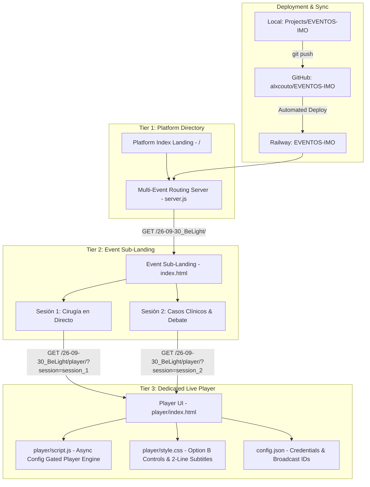

# Technical Implementation Plan: EVENTOS-IMO Platform

> [!IMPORTANT]
> **Instructions for the Coding Agent**:
> 1. **Incremental bottom-up execution**: Follow this roadmap in order, starting from Phase 0 (UI Skeleton & Platform Shell). Do not jump ahead.
> 2. **Explicit Verification & Approval Gates**: After completing each phase, execute its specified verification step. Stop and present results to the user for explicit approval before advancing to the next phase.
> 3. **Dynamic Task Discovery & Sync**: If you or the user encounter logical inconsistencies, missing edge cases, or implementation details that require new tasks or sub-tasks, immediately:
>    - Add the new task/sub-task under the appropriate phase in this file (`02-Implementation.md`).
>    - Document and update the corresponding files in [01-idea.md](./01-idea.md) and [00-index.md](./00-index.md).
> 4. **No Code in Tasks**: Keep this file purely procedural. Do not add raw code blocks or implementation code directly to this file. Refer to [01-idea.md](./01-idea.md) and [00-index.md](./00-index.md) using relative paths.
> 5. **Doubt Resolution**: In case of ambiguity or multiple viable implementation paths, stop and ask the user, presenting trade-offs clearly.

---

## 1. Architectural Overview & Dependency Flow

The **EVENTOS-IMO** platform operates as a centralized multi-event broadcasting hub on Railway using a **3-Tier Hierarchy**:



---

## 2. Directory Layout & File Responsibility Matrix

```text
EVENTOS-IMO/
├── 00-index.md                    # Project documentation & file catalog [refer to ./00-index.md]
├── 01-idea.md                     # Platform vision, 3-tier architecture & spec [refer to ./01-idea.md]
├── 02-Implementation.md           # Implementation plan & phase checklist (this file)
├── package.json                   # Node.js process definition and runtime scripts
├── server.js                      # Multi-event HTTP routing server & subpath handler
├── index.html                     # Tier 1: Platform root directory landing linking to events
├── style.css                      # Miranza clinical design system
└── 26-09-30_BeLight/              # Event subfolder for Be-Light (2026-09-30)
    ├── index.html                 # Tier 2: Event sub-landing page (session picker, agenda)
    ├── style.css                  # Event landing page stylesheet
    ├── config.json                # Supabase credentials & YouTube session broadcast IDs
    ├── embed.js                   # Host page embed helper & Matomo telemetry bridge
    └── player/                    # Tier 3: Dedicated Live Player Engine
        ├── index.html             # Video player UI, back navigation & session pills
        ├── script.js              # Async config-gated YouTube player & Supabase captions
        └── style.css              # Custom Option B controls, subtitle box & dark/light theme
```

---

## Phase 0: UI Skeleton & Platform Shell Navigation
*Focus: Establish the platform landing page shell, visual branding, and navigation paths to event subfolders.*

- [x] **Task 0.1: Platform Root Landing Page UI Shell**
  - **Objective**: Build the top-level index directory for EVENTOS-IMO displaying available events.
  - **Details**:
    - [x] Create semantic HTML layout with header branding, platform subtitle, and event grid container [refer to ./01-idea.md].
    - [x] Implement clean event card component for the active event `26-09-30_BeLight` with event date, title, tags, and single CTA button targeting `/26-09-30_BeLight/`.
    - [x] Add empty/placeholder slot indicating upcoming future events to demonstrate extensibility.
    - [x] Establish minimalist, clinical CSS design system inspired by "www.miranza.es" (deep navy `#002D62`, clinical blue `#00669D`, Miranza green `#73cf91`, soft background `#F7F9FA`).
  - **Verification**:
    - Open landing page in browser. Confirm that the platform header, clean Be-Light card, and upcoming placeholder render with the Miranza aesthetic.

- [x] **Task 0.2: Navigation Flow & Parameter Hand-off**
  - **Objective**: Verify navigation from the platform directory to event sub-landings.
  - **Details**:
    - [x] Configure action link on the Be-Light card pointing to `/26-09-30_BeLight/`.
    - [x] Provide clean breadcrumbs on sub-pages linking back to the platform root.
  - **Verification**:
    - Click "Acceder al Evento". Confirm smooth navigation to `/26-09-30_BeLight/`.

> [!NOTE]
> **Phase 0 Approval Gate**: Completed and verified.

---

## Phase 1: Multi-Event HTTP Server & Routing Engine
*Focus: Build a robust, zero-dependency Node.js server that routes platform traffic, serves sub-landings, and handles player routes with CORS support.*

- [x] **Task 1.1: Platform HTTP Server Architecture**
  - **Objective**: Create the core Node.js web server with environment-driven port binding and MIME resolution.
  - **Details**:
    - [x] Create project manifest with start script and Node engine specifications [refer to ./01-idea.md].
    - [x] Implement HTTP server binding to environment port or defaulting to port 3000.
    - [x] Implement complete MIME type map for HTML, JS, CSS, JSON, SVG, PNG, JPG, and ICO.
    - [x] Add permissive CORS response headers (`Access-Control-Allow-Origin: *`) to ensure `embed.js` and `config.json` can be loaded from external client host domains.
    - [x] Add security path normalization to prevent directory traversal outside the project root.
  - **Verification**:
    - Start server locally. Verify HTTP 200 OK with correct Content-Type and CORS headers.

- [x] **Task 1.2: 3-Tier Subpath Resolution & Asset Rewrite Engine**
  - **Objective**: Route requests to root directory, event sub-landings, and dedicated player folders cleanly.
  - **Details**:
    - [x] Directory resolution: serving `index.html` directly when accessing event subfolders (e.g. `/26-09-30_BeLight/` serves `26-09-30_BeLight/index.html`).
    - [x] Player subpath routing: requests to `/26-09-30_BeLight/player/` serve `26-09-30_BeLight/player/index.html` preserving query parameters (`?session=session_1`).
    - [x] Intelligent asset & config resolution: requests to `player/config.json` transparently resolve the event root `config.json`.
    - [x] Support direct asset requests for embed scripts (`/26-09-30_BeLight/embed.js`).
    - [x] Backward compatibility: `/Client/` transparently aliases to `/player/`.
  - **Verification**:
    - Automated test against port 3089 verifying all 6 route permutations return HTTP 200 OK.

- [x] **Task 1.3: Server Logging & Diagnostic Output**
  - **Objective**: Provide structured request logging for operational debugging in Railway logs.
  - **Details**:
    - [x] Log incoming request method, path, client IP, and response status code.
    - [x] Add startup banner logging active port and registered event directories.
  - **Verification**:
    - Verify structured terminal logs reflect requests accurately.

> [!NOTE]
> **Phase 1 Approval Gate**: Completed and verified.

---

## Phase 2: Be-Light Event Integration & Bug Resolution
*Focus: Build the dedicated event sub-landing, fix the YouTube player async race condition, and implement in-player session switching.*

- [x] **Task 2.1: Be-Light Event Sub-Landing Page**
  - **Objective**: Build the dedicated portal for Be-Light 2026.
  - **Details**:
    - [x] Create `26-09-30_BeLight/index.html` with breadcrumbs, clinical hero banner, date, and description.
    - [x] Create session selector cards for Sesión 1 (Cirugías en Directo, `JVe72x6qjfo`) and Sesión 2 (Casos Clínicos & Debate, `XZ6oYuFedCk`).
    - [x] Implement direct links to `player/?session=session_1` and `player/?session=session_2`.
    - [x] Provide collapsible embed code drawer for external partner integration.
  - **Verification**:
    - Verify sub-landing page renders cleanly with responsive cards and active links.

- [x] **Task 2.2: Player Engine Async Config Gating & Fallback Fix**
  - **Objective**: Eliminate the race condition where ARI2026 played when clicking Be-Light Session 1.
  - **Details**:
    - [x] Remove hardcoded ARI2026 fallback IDs from `player/script.js`.
    - [x] Set fallback credentials to Be-Light defaults.
    - [x] Implement gating function `tryInitYouTubePlayer()`: YouTube player instantiation is strictly blocked until `config.json` has finished loading over HTTP.
    - [x] Apply the identical fix to `Projects/Live-Speech-MLX-TX/02-08-EnbededWebClient_Matomo`.
  - **Verification**:
    - Run JavaScript syntax check across all modified files. Verify zero errors.

- [x] **Task 2.3: In-Player Navigation & Session Switching**
  - **Objective**: Allow users to switch sessions without leaving the player, and navigate back to the event landing.
  - **Details**:
    - [x] Add top navigation bar in `player/index.html` with `← Volver a Be-Light 2026` link.
    - [x] Add session switcher pills (`Sesión 1` | `Sesión 2`) with active state highlighting.
  - **Verification**:
    - Verify player navigation bar displays and active pill reflects the current query parameter.

- [x] **Task 2.4: Viewport Scaling Recalculation & Light/Dark Theme Switcher**
  - **Objective**: Prevent vertical cutoff on widescreen/fullscreen displays and add interactive theme switching.
  - **Details**:
    - [x] Re-calculate dynamic CSS stage width formula (`--stage-width`) accounting for all non-video chrome height (`~184px`).
    - [x] Lock navbar, video player, video controls, subtitle controls, and subtitle box to the exact same responsive width.
    - [x] Slim down navigation bar to `28px` with compact typography and pill buttons.
    - [x] Replace static "EN DIRECTO" badge with interactive Light / Dark Mode switcher button (`☀️ / 🌙`) with `localStorage` persistence.
    - [x] Enforce `flex-shrink: 0` on all fixed-height UI elements to prevent distortion on wide aspect ratios.
  - **Verification**:
    - Test fullscreen and standard 16:9 viewport. Verify 100% of navbar, video, controls, and subtitle box are visible with zero cutoff and zero scrollbars.

> [!NOTE]
> **Phase 2 Approval Gate**: Completed and verified.

---

## Phase 3: GitHub Repository & Railway Cloud Deployment
*Focus: Maintain the GitHub repository, deploy updates to Railway, and perform end-to-end production verification.*

- [x] **Task 3.1: Git Repository Structure & Local Version Control**
  - **Objective**: Initialize and configure the Git repository for EVENTOS-IMO.
  - **Details**:
    - [x] Create `.gitignore` to exclude OS files (`.DS_Store`), temporary artifacts, and node modules.
    - [x] Initialize Git repository in the project folder and push to GitHub `alxcouto/EVENTOS-IMO`.
  - **Verification**:
    - Verify remote origin URL points to `https://github.com/alxcouto/EVENTOS-IMO.git`.

- [x] **Task 3.2: Railway Project Setup & Continuous Deployment**
  - **Objective**: Provision a new Railway project and connect it to the GitHub repository.
  - **Details**:
    - [x] Railway project provisioned by user and linked to `alxcouto/EVENTOS-IMO`.
    - [x] Automatic deployment configured on push to `main` branch.
    - [x] Public Railway production domain assigned and accessible.
  - **Verification**:
    - User confirmed initial deployment is browsable.

- [ ] **Task 3.3: Production Environment Verification & Health Check**
  - **Objective**: Perform end-to-end verification of the deployed 3-tier platform on Railway.
  - **Details**:
    - [ ] Push updated 3-tier architecture and race-condition fix to GitHub `main`.
    - [ ] Verify automatic Railway redeployment succeeds without errors.
    - [ ] Navigate to the Railway production URL root (`/`).
    - [ ] Click "Acceder al Evento" -> verify Be-Light sub-landing loads (`/26-09-30_BeLight/`).
    - [ ] Click "Sesión 1" -> verify player loads Be-Light Session 1 (`JVe72x6qjfo`) and NOT ARI2026.
    - [ ] Click "Sesión 2" -> verify player loads Be-Light Session 2 (`XZ6oYuFedCk`).
    - [ ] Verify "← Volver a Be-Light 2026" returns to the sub-landing.
  - **Verification**:
    - Perform live browser test on Railway domain. Confirm all 3 tiers navigate smoothly and playback is correct.

> [!NOTE]
> **Phase 3 Approval Gate**: Stop and confirm live Railway production status with the user.

---

## Phase 4: Multi-Event Extensibility Framework & Local Backup Protocol
*Focus: Establish a repeatable process for adding future events and maintaining local backup synchronization.*

- [ ] **Task 4.1: Standardized Event Folder Blueprint**
  - **Objective**: Document the standardized folder pattern and configuration checklist for adding new events.
  - **Details**:
    - [ ] Define folder naming convention (`YY-MM-DD_EventName/`) [refer to ./01-idea.md].
    - [ ] Document required assets: `index.html` (sub-landing), `config.json`, `embed.js`, `player/index.html`, `player/script.js`, and `player/style.css`.
  - **Verification**:
    - Review documentation in [00-index.md](./00-index.md).

- [ ] **Task 4.2: Platform Landing Page Event Registration**
  - **Objective**: Define how new events are registered on the platform directory page.
  - **Details**:
    - [ ] Document updating `index.html` with new event cards and links to sub-landings.
  - **Verification**:
    - Inspect landing page markup to ensure adding subsequent cards follows the established design tokens.

- [ ] **Task 4.3: Local Backup Synchronization Protocol**
  - **Objective**: Ensure the local folder `Projects/EVENTOS-IMO` remains the master backup of the Railway platform.
  - **Details**:
    - [ ] Establish two-way sync protocol: edits made locally, committed to Git, and automatically deployed to Railway.
  - **Verification**:
    - Test sync check ensuring local repository matches GitHub `main` and Railway active deployment.

- [ ] **Task 4.4: Future Roadmap - "New Event Wizard" Architecture & Specification**
  - **Objective**: Design the extensible workflow for a browser-based "New Event Wizard" on the platform landing page.
  - **Details**:
    - [ ] Specify wizard UI modal/form triggered from the platform landing page [refer to ./01-idea.md].
    - [ ] Define input parameters: Event Title, Event Date, Folder Slug (`YY-MM-DD_EventName`), Description, and `config.json`.
  - **Verification**:
    - Review wizard architectural specification in documentation.
